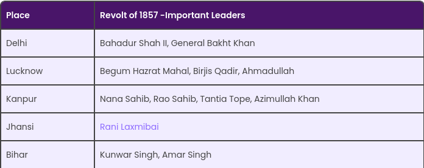

# Place

# Name

# Date
- Revolt of 1857: Military Factor, July 25, 1856. General Enlistment Act.

# > Revolt of 1857

## Immediate Factor

- The immediate factor was the introduction of the ‘Enfield’ rifle.
- The cartridge had to be bitten off before loading it into the gun.
- Indian sepoys believed that the cartridge was greased with either pig fat or made from cow fat.
- This was against the Hindu and Muslim sentiments. Thus they were reluctant to use the ‘Enfield’ rifle.
- This was a flashpoint to enrage the soldiers against the British.

## Cause

### Religious and Social Cause
1) Racism or racial discrimination was believed to be a major reason for the revolt of 1857
2) Wherein Indians were exploited and were kept away from mixing with Europeans
3) The whites also started interfering in the religious and cultural affairs of Indians and tortured them as well.

### Political Cause
1) Due to Britishers unjust policies the power of the Nawabs and Zamindars were lost.
2) Policy of Trade and Commerce.
3) Policy of indirect subordination. ( subsidiary alliance )
4) Policy of war and annexation.
5) Policy of direct subordination. ( **doctrine of lapse**, the doctrine of lapse was annexation policy followed by Dal housie, who was indian governer general from 1848 - 56.)
6) Policy of misgovernance.
7) These policies greatly hampered the interests of the rulers of the native states.

### Economic Factor
> Indians were affected by reforms in Economic by the British.
1) There were various reforms in the taxation and revenue system that affected the peasants’ heavily.
2) British Government had imposed and introduced various administrative policies to expand their territory.

### Military Factor
> They wanted new recruits for the Bengal Army, which affected their son from following or serving overseas.
1) Another major cause was the **General Enlistment Act of July 25 1856.**
2) The act required that new recruits to the Bengal Army to accept a commitment for general service.
3) Governor-General Lord Dalhousie felt it unfair that the burden of deployment fell squarely on the smaller presidency armies.
4) Sepoys of the Bengal Army felt that it would also prevent their sons from following their footsteps while fearing the prospect of serving overseas.

## Impact
- The major impact was the introduction of the Government of India Act.
- In 1858 which abolished the rule of British East India Company.
- The beginning of British raj that bestowed powers in the hands of the British government to rule India directly through representatives.

## Causes of Failure of revolt of 1857.
- The sepoys lacked one clear leader; there were several. They also did not have a coherent plan by which the foreigners would be routed.
- Indian rulers who aided the revolt did not envision any plan for the country after the British were defeated.
- Majorly **northern India** was affected by this revolt.
- The three presidencies of **Bengal, Bombay and Madras** remained mostly unaffected.

